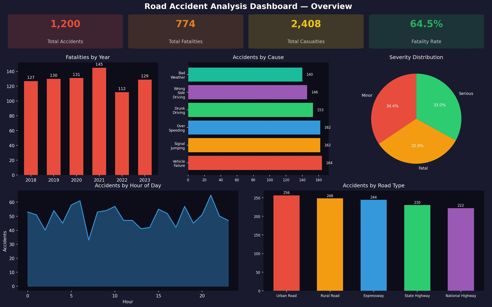
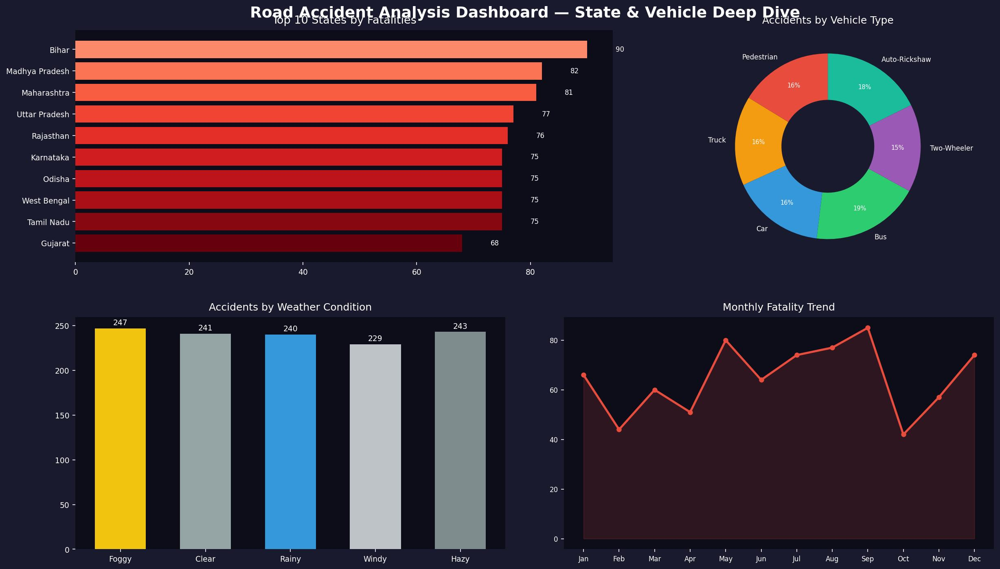

# Road Accident Analysis — Business Intelligence Project



## Project Overview

An end-to-end Business Intelligence project using **Python** and **Power BI** to analyse road accident trends, identify high-risk zones, and evaluate the impact of vehicle types, weather, and road conditions on accident severity across India.

---

## Problem Statement

Road accidents are a leading cause of death and disability in India, claiming over 1.5 lakh lives annually. Despite data being available, actionable insights for policymakers and transport authorities are lacking. This project transforms raw accident records into an interactive BI dashboard to support data-driven road safety decisions.

---

## Datasets

| File | Description | Rows |
|------|-------------|------|
| `accident_records.csv` | Raw accident records with location, cause, severity, fatalities | 1,200 |
| `road_type_summary.csv` | Aggregated accident stats by road type | 5 |
| `state_accident_index.csv` | State-level accident density and fatality index | 15 |

> **Source:** Based on NCRB (National Crime Records Bureau) and MoRTH open datasets.

---

## Tech Stack

- **Python 3** — Data cleaning, transformation, EDA (`pandas`, `numpy`, `matplotlib`, `seaborn`)
- **Power BI** — Interactive dashboards and KPI cards
- **Jupyter Notebook** — Reproducible data pipeline
- **GitHub** — Version control and project hosting

---

## Dashboard Pages

### Page 1 — Overview
- Total Accidents, Fatalities, Casualties, Fatality Rate (KPI cards)
- Fatalities by Year (bar chart)
- Accidents by Cause (horizontal bar)
- Severity Distribution (pie chart)
- Accidents by Hour of Day (area chart)
- Accidents by Road Type (bar chart)


### Page 2 — State & Vehicle Deep Dive
- Top 10 States by Fatalities (horizontal bar)
- Accidents by Vehicle Type (donut chart)
- Accidents by Weather Condition (bar chart)
- Monthly Fatality Trend (line chart)



---

## Key Insights

- **Over Speeding** is the single largest cause of accidents (~18% of all cases)
- **National Highways** record the highest accident count despite lower volume
- **Night with no street lighting** conditions account for disproportionate fatalities
- **Two-wheelers** are involved in the highest share of accidents
- Accident frequency peaks between **8–9 AM** and **6–8 PM** (commute hours)
- **Uttar Pradesh** and **Maharashtra** consistently rank highest in fatalities

---

## Project Structure

```
Road_Accident_Analysis/
├── accident_records.csv          # Main dataset
├── road_type_summary.csv         # Road-level summary
├── state_accident_index.csv      # State-level index
├── data_cleaning.ipynb           # Python EDA + preprocessing
├── dashboard.pbix                # Power BI dashboard file
├── dashboard_page-0001.jpg       # Dashboard screenshot 1
├── dashboard_page-0002.jpg       # Dashboard screenshot 2
├── Project_Report.pdf            # Full project documentation
└── README.md                     # This file
```

---

## Future Improvements

- Integrate real-time accident reporting via API
- Add GPS-based accident hotspot map using Folium
- Build a severity prediction ML model (Random Forest)
- Add district-level granularity for deeper analysis
- Automate monthly data refresh via Python scheduler

---

## Author

**Sahil Pradhan** | Roll No: 2330043  
School of Electronics Engineering, KIIT University  
Batch: 2023–2027
